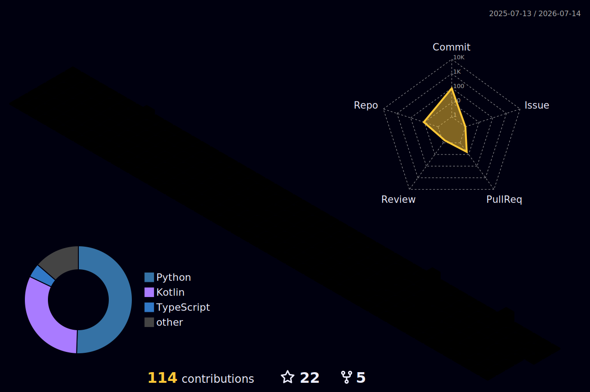

<p align="center">
  
</p>

<p align="center">
  
</p>

<p align="center">
  <a href="mailto:eternal_blue@foxmail.com"></a>
  <a href="mailto:m04y08x20@gmail.com"></a>
  
</p>

<h3 align="center">COSMIC SIGNAL</h3>

<p align="center">
  AI开发 / 全栈开发<br />
  在代码、智能体与星云之间，探索无尽命运的轨道。
</p>

<h3 align="center">TECH UNIVERSE</h3>

<p align="center">
  
  
  
  
  
  
  
  
  
  
  
</p>

<h3 align="center">COSMIC ACHIEVEMENTS</h3>

<p align="center">
  
</p>

<h3 align="center">STAR CHART</h3>

<p align="center">
  
  
</p>

<p align="center">
  
</p>

<h3 align="center">METRICS CONSTELLATION</h3>

<p align="center">
  
</p>

<h3 align="center">3D CONTRIBUTION ORBIT</h3>

<p align="center">
  
</p>

<h3 align="center">CONTRIBUTION SNAKE</h3>

<p align="center">
  <picture>
    <source media="(prefers-color-scheme: dark)" srcset="./assets/github-snake-dark.svg" />
    <source media="(prefers-color-scheme: light)" srcset="./assets/github-snake.svg" />
    
  </picture>
</p>

<h3 align="center">CODING FREQUENCY</h3>

<!--START_SECTION:waka-->

```txt
From: 28 May 2026 - To: 04 June 2026

Total Time: 0 secs

No activity tracked
```

<!--END_SECTION:waka-->

<p align="center">
  
</p>
